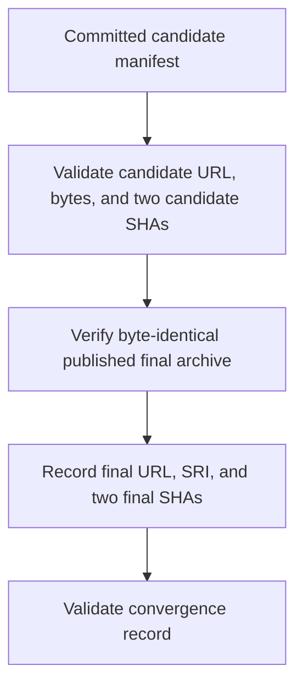
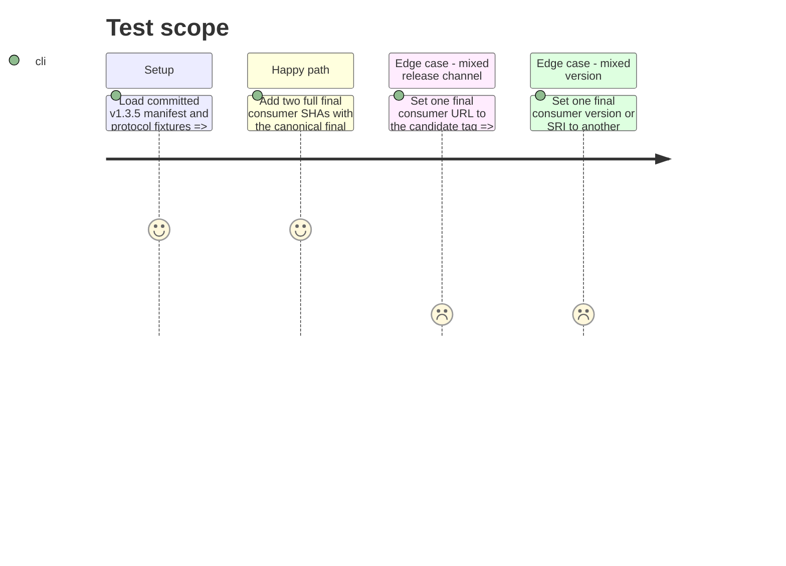

# Instruction: Model candidate proof and final convergence separately

## Architecture projection

> Tree of final files. ✅ create · ✏️ modify · ❌ delete

```txt
schema-in-the-mist/
├── ✏️ tools/release-train-manifest.ts       validate separate candidate and final identities and both final consumer SHAs
├── ✏️ tools/validate-release-train.ts       validate the committed train lifecycle record
├── ✏️ tools/test-release-train-manifest.ts  cover pending and converged records plus channel/version mismatches
├── ✏️ test/fixtures/release-trains/valid.json  exercise the updated protocol shape
├── ✅ tools/release-train-completion.ts    validate committed completion evidence against the manifest
└── ✏️ release-trains/v1.3.5.json            keep the real train valid during transition, then record final refs in phase 3
```

No files are deleted.

## User Journey



## Test Scope



## Tasks to do

### `1)` Define the lifecycle record

> Pre-promotion proof and post-promotion convergence need distinct identities and states.

1. Extend the manifest/evidence types with an explicit pending/completed state and a final-consumer section that must name exactly Lantern and Handbook with canonical repositories and full commit SHAs when completed.
2. Require the final archive URL to be exactly `https://github.com/RebelliousSmile/schema-in-the-mist/releases/download/<finalTag>/schema-in-the-mist-<version>.tgz`, and require the final SRI and SHA-256 to equal the candidate's published values.
3. Make an explicit completion validator reject missing final refs or evidence, different final URLs, versions, channels, SRI, and duplicate roles; keep candidate evidence validation intact. Bind the final evidence to the manifest and original candidate proof so a self-declared completed state is insufficient.

### `2)` Validate the committed manifest and protocol fixtures

> Repository validation must exercise the actual train record as well as synthetic failures.

1. Update the real v1.3.5 manifest to an explicit pending state without fabricating final SHAs; reserve completed state and final refs for phase 3.
2. Extend the manifest test with mixed-channel, mixed-version, stale-SRI, missing-ref, and duplicate-role cases.
3. Confirm `release-train:validate` reads `release-trains/v1.3.5.json` and remains in the default `npm run check` path.

## Test acceptance criteria

| Task | Acceptance criteria |
| --- | --- |
| 1 | Candidate proof remains valid while pending, but completion validation requires two immutable final refs, a canonical final artifact identity, and matching evidence. |
| 2 | The committed v1.3.5 record and fixture tests pass their intended lifecycle states; mixed versions, channels, or SRI values fail. |
