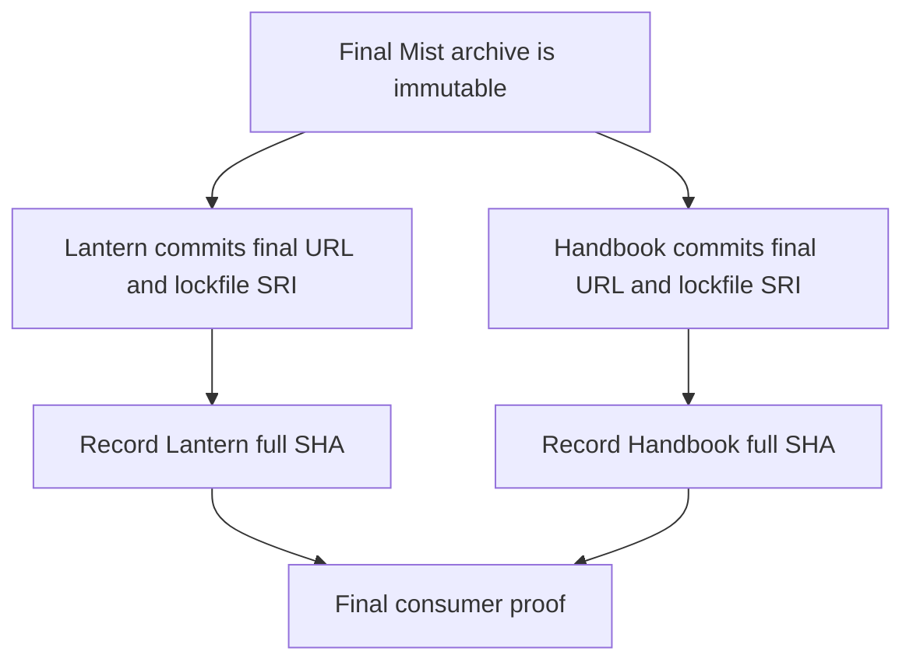
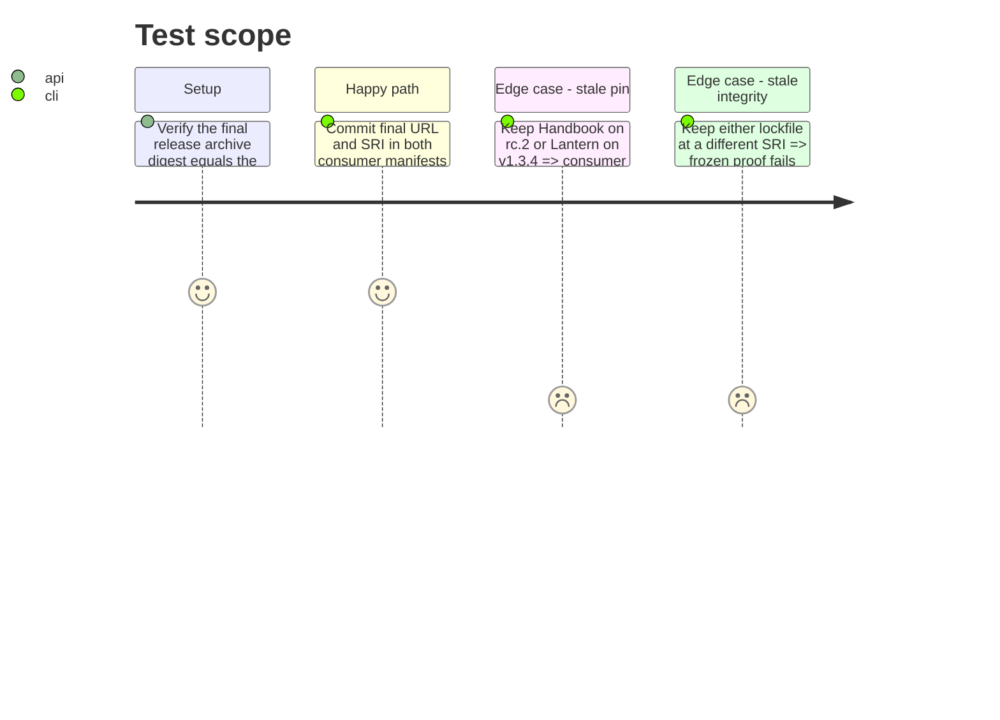

# Instruction: Enable Mist proof and commit canonical final pins in both consumers

## Architecture projection

> Tree of final files. ✅ create · ✏️ modify · ❌ delete

```txt
lantern/ (consumer-owned repository)
├── ✏️ package.json                    pin the canonical Mist final archive URL
├── ✏️ pnpm-lock.yaml                 pin that archive with its exact published SRI
├── ✏️ package-lock.json              keep npm resolution aligned with the final URL and SRI
├── ✏️ tools/release-train-protocol.mjs  accept the provider's Mist final-proof payload
├── ✏️ tools/release-train-assert.mjs  run the Mist production Vite journey and emit compatible evidence
└── ✏️ tools/assert-consumer-schema-pins.mjs  enforce promoted final pins in the default check
obsidian-handbook/ (consumer-owned repository)
├── ✏️ package.json                    pin the canonical Mist final archive URL
├── ✏️ pnpm-lock.yaml                 pin that archive with its exact published SRI
├── ✏️ tools/release-train-protocol.mjs  accept the provider's Mist final-proof payload
├── ✏️ tools/release-train-assert.mjs  dispatch Mist final proof
├── ✅ tools/release-train-schema-in-the-mist-assert.mjs  prove the Mist archive and host artifact
└── ✏️ tools/assert-consumer-schema-pins.mjs  enforce promoted final pins in the default check
```

No files are deleted. Additional consumer-owned test or release metadata files follow each repository's release process.

## User Journey



## Test Scope



## Tasks to do

### `1)` Finish Lantern's final adoption

> Lantern must prove the published final archive from a committed dependency graph.

1. Follow Lantern #46: change `package.json`, `pnpm-lock.yaml`, and `package-lock.json` from v1.3.4 to the canonical v1.3.5 final URL and exact published SRI.
2. Extend Lantern's current release-train protocol and journey dispatch to accept the provider's Mist final-proof payload, run the production Vite assertions, and emit evidence with exact URL, version, SRI, lock resolution, and full commit SHA. Keep its default schema-pin assertion aligned.
3. Run frozen install and the Mist proof; record the resulting full commit SHA only after checks pass.

### `2)` Finish Handbook's final adoption

> Handbook must prove the same final archive from its own immutable commit.

1. Follow Handbook #63: change `package.json` and the active `pnpm-lock.yaml` from v1.3.5-rc.2 to the identical canonical final URL and published SRI.
2. Add Mist dispatch and proof to its current PbtA/Adrenaline-only release-train interface, including frozen resolution, production build, and the required Obsidian plugin-load gate. Emit evidence compatible with the provider's final-proof parser.
3. Run a frozen install and the new Mist proof at the final commit; record the full SHA only after checks pass.

## Test acceptance criteria

| Task | Acceptance criteria |
| --- | --- |
| 1 | Lantern's immutable final commit contains the canonical Mist URL and exact published SRI in both lockfiles, and its frozen install and Mist Vite proof emit compatible evidence. |
| 2 | Handbook's immutable final commit contains that same URL and SRI, and its frozen install and Mist host-artifact proof emit compatible evidence. |
