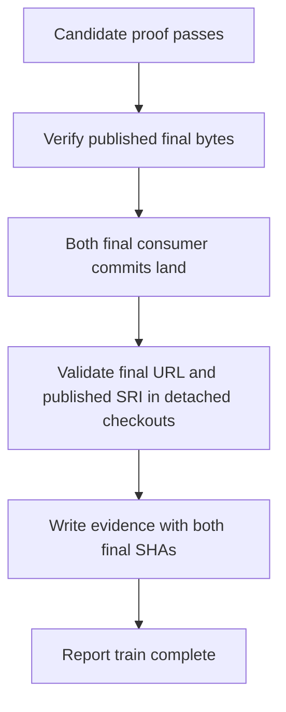
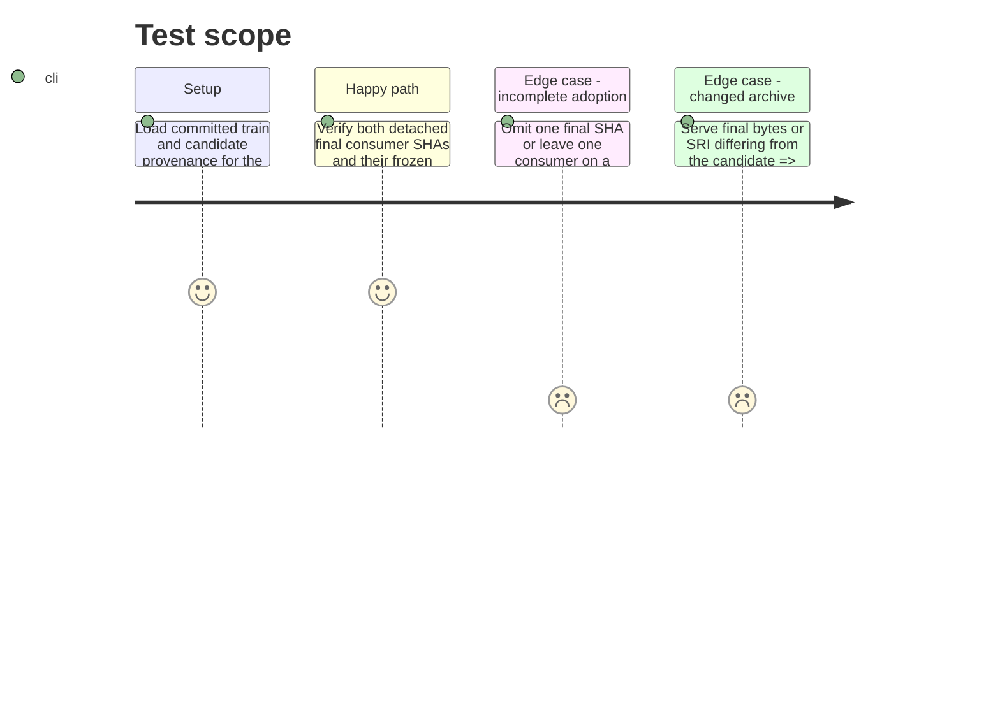

# Instruction: Verify the published final release and record convergence

## Architecture projection

> Tree of final files. ✅ create · ✏️ modify · ❌ delete

```txt
schema-in-the-mist/
├── ✏️ tools/release-train-promote.ts       report publication and byte identity separately from completion
├── ✅ tools/release-train-converge.ts      verify final archive and detached final consumer commits; write evidence
├── ✏️ tools/release-train-completion.ts     bind final proof to the real manifest before writing evidence
├── ✏️ tools/test-release-train-promotion.ts  test publication versus completion and rejection paths
├── ✅ tools/test-release-train-convergence.ts  test real-record and mixed-channel gates
├── ✏️ release-trains/v1.3.5.json           record both verified final consumer SHAs
├── ✅ release-trains/v1.3.5.convergence.json  record final archive identity and two verified consumer SHAs
└── ✏️ package.json                         expose the convergence command
```

No files are deleted.

## User Journey



## Test Scope



## Tasks to do

### `1)` Verify and record final convergence

> Completion must depend on both published bytes and committed consumer state.

1. Make promotion verify and reuse an already-published final release only when its tag, archive, checksum, digest, and immutable state match the candidate; never recreate or overwrite v1.3.5. A fresh release path must re-fetch and verify final bytes before reporting publication.
2. Add a convergence command that reads the committed manifest, checks the published final URL and bytes, checks out each declared full consumer SHA in a disposable detached directory, performs frozen installs, and invokes the compatible consumer-owned Mist proofs without modifying their committed manifests or lockfiles.
3. Parse final evidence with exact URL, version, SRI, repository, role, ref, and consumer proof checks matching; emit a post-promotion record containing both final SHAs and report train completion only after all checks pass.

### `2)` Record the real train's final evidence

> The Mist train must name the two consumer commits proven against the published final archive.

1. Populate the existing `release-trains/v1.3.5.json` with the two actual final consumer SHAs after phase 2, keeping its candidate refs and its format without a `protocol` field.
2. Run the network-backed convergence command after both SHAs are reachable on GitHub; commit its `release-trains/v1.3.5.convergence.json` output only after published byte identity and both detached consumer proofs pass.
3. Test changed final bytes, missing or wrong consumer refs, and mismatched final URL, version, or SRI.

## Test acceptance criteria

| Task | Acceptance criteria |
| --- | --- |
| 1 | Existing v1.3.5 is verified without mutation; publication alone never reports train completion, and final evidence contains both immutable SHAs only after identical final bytes and matching consumer proofs pass. |
| 2 | The real Mist v1.3.5 manifest retains its original candidate identity and records both verified final SHAs; the matching convergence file is created only after the remote proof passes. |
