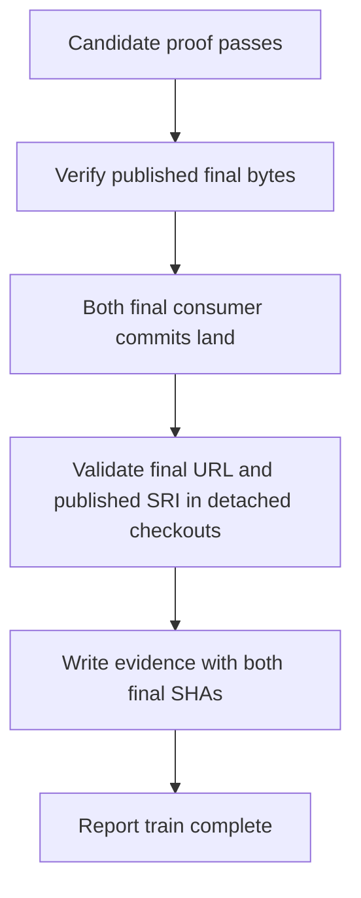
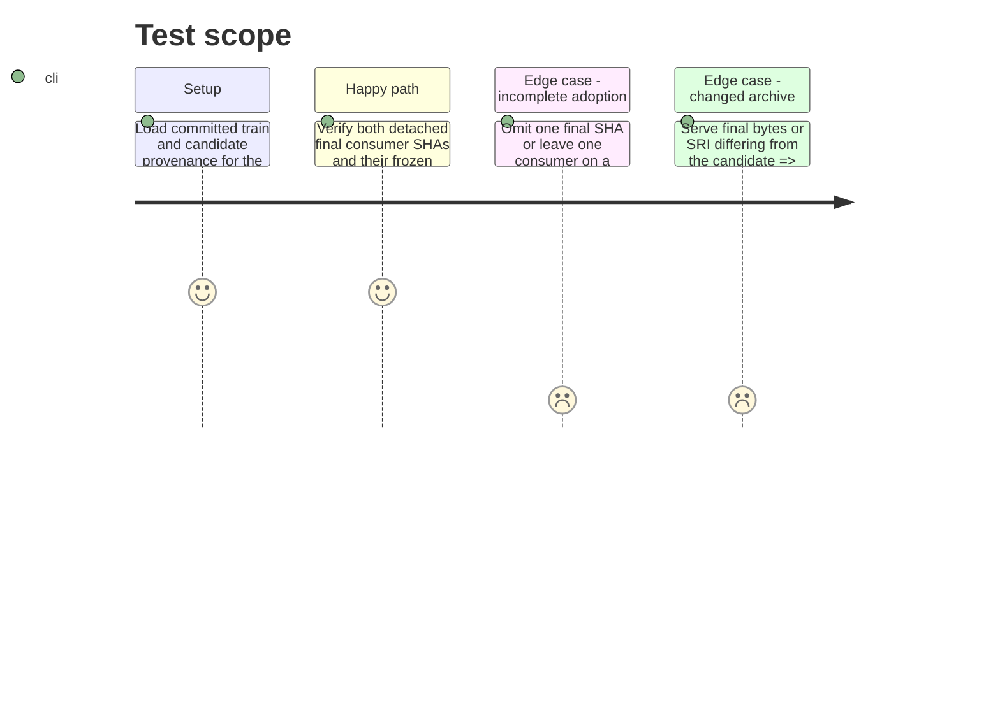

# Instruction: Verify the published final release and gate completion

## Architecture projection

> Tree of final files. ✅ create · ✏️ modify · ❌ delete

```txt
schema-in-the-mist/
├── ✏️ tools/release-train-promote.ts       report publication and byte identity separately from completion
├── ✅ tools/release-train-converge.ts      verify final archive and detached final consumer commits; write evidence
├── ✏️ tools/release-train-manifest.ts       parse and bind post-promotion evidence to final refs
├── ✏️ tools/release-train-completion.ts     validate committed final evidence in offline CI
├── ✏️ tools/test-release-train-promotion.ts  test publication versus completion and rejection paths
├── ✅ tools/test-release-train-convergence.ts  test real-record and mixed-channel gates
├── ✏️ release-trains/v1.3.5.json           record both verified final consumer SHAs
├── ✅ release-trains/v1.3.5.convergence.json  record final archive identity and two verified consumer SHAs
├── ✏️ release-trains/README.md             document the complete release sequence and evidence
├── ✏️ package.json                         expose convergence and include committed-record validation in check
└── ✏️ .github/workflows/ci.yml             run the committed-manifest gate in routine CI
```

No files are deleted.

## User Journey



## Test Scope



## Tasks to do

### `1)` Verify and record final convergence

> Completion must depend on both published bytes and committed consumer state.

1. Make promotion verify and reuse an already-published final release only when its tag, archive, checksum, digest, and immutable state match the candidate; never recreate or overwrite v1.3.5. A fresh release path must re-fetch and verify final bytes before reporting publication.
2. Add a convergence command that reads the committed manifest, checks the published final URL and bytes, checks out each declared full consumer SHA in a disposable detached directory, performs frozen installs, and invokes the compatible consumer-owned Mist proofs without modifying their committed manifests or lockfiles.
3. Parse final evidence with exact URL, version, SRI, repository, role, ref, and consumer proof checks matching; emit a post-promotion record containing both final SHAs and report train completion only after all checks pass.

### `2)` Make the real train a routine validation input

> CI must reject a committed train that claims completion without final convergence.

1. Populate the v1.3.5 manifest with the two actual final consumer SHAs after phase 2 and commit the matching convergence record; retain candidate refs and provenance as the prerequisite proof.
2. Wire the committed manifest and convergence record through `npm run check` and `.github/workflows/ci.yml` so routine offline CI rejects a pending or inconsistent v1.3.5 train. Run network-backed final archive and detached-consumer verification in the completion gate, not as a substitute for the committed-record CI check.
3. Update `release-trains/README.md` with the candidate proof, byte-identical publication, final pin commits, convergence command, evidence location, and completion boundary.
4. Test one valid completed train plus missing consumer, wrong channel, version, SRI, ref, and changed final bytes.

## Test acceptance criteria

| Task | Acceptance criteria |
| --- | --- |
| 1 | Existing v1.3.5 is verified without mutation; publication alone never reports train completion, and final evidence contains both immutable SHAs only after identical final bytes and matching consumer proofs pass. |
| 2 | Routine CI reads the committed v1.3.5 manifest and convergence record, rejects pending or divergent final pins, and fixture tests cover failure paths. |
