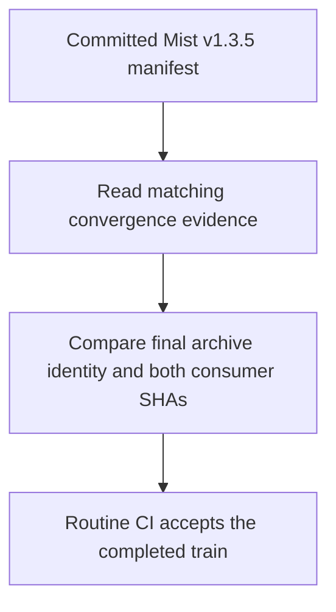
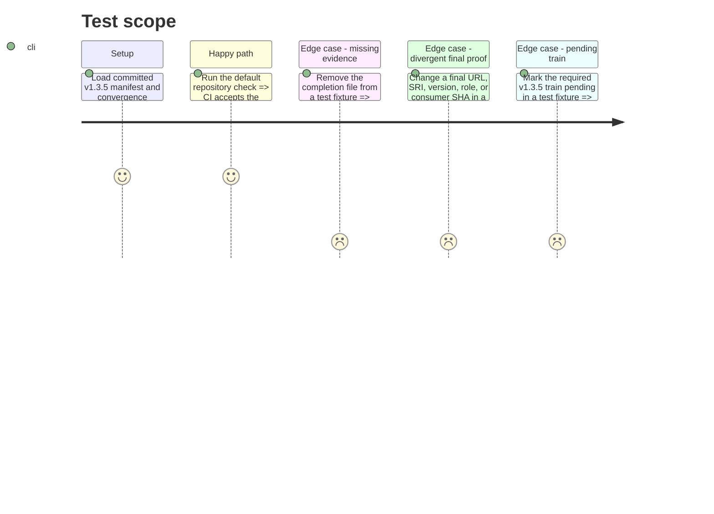

# Instruction: Validate the committed Mist train in routine CI

## Architecture projection

> Tree of final files. ✅ create · ✏️ modify · ❌ delete

```txt
schema-in-the-mist/
├── ✏️ tools/validate-release-train.ts       read the real manifest and its completion evidence
├── ✏️ tools/release-train-completion.ts      bind committed evidence to the manifest and both final refs
├── ✏️ tools/test-release-train-convergence.ts  cover valid and divergent committed records
├── ✏️ package.json                          require the real completed train in the default check
├── ✏️ .github/workflows/ci.yml              run the same check in routine CI
└── ✏️ release-trains/README.md              document the manifest, proof versions, and completion boundary
```

No files are deleted. Phase 3 creates `release-trains/v1.3.5.convergence.json`; this phase validates that committed file alongside `release-trains/v1.3.5.json`.

## User Journey



## Test Scope



## Tasks to do

### `1)` Validate the real committed manifest

> Routine checks must use Mist's actual train record, not only synthetic fixtures.

1. Scan committed `release-trains/v<version>.json` manifests, including `v1.3.5.json`, and load a matching `.convergence.json` for each completed train. Keep the manifest format free of `protocol`; `protocol: 1` belongs to candidate evidence and `protocol: 2` to final evidence.
2. Require the real v1.3.5 train to be completed in `npm run check` and CI. Reject missing evidence or a final URL, digest, SRI, version, role, or full consumer SHA that differs from the manifest.
3. Confirm the committed v1.3.5 record passes the default check without substituting a fabricated manifest or evidence file.

### `2)` Document the completion boundary

> Maintainers need to know which proof establishes publication and which establishes adoption.

1. Document candidate proof, immutable byte-identical promotion, final consumer pin commits, convergence evidence, and routine CI validation in `release-trains/README.md`.
2. State that `release-trains/v1.3.5.json` is the Mist-owned authoritative manifest. The final proof writes an input payload only in a disposable consumer checkout; it creates no committed Lantern release-train manifest.

## Test acceptance criteria

| Task | Acceptance criteria |
| --- | --- |
| 1 | Default checks and CI parse the real committed Mist v1.3.5 manifest and matching convergence evidence; pending, missing, or divergent final evidence fails. |
| 2 | The documented flow distinguishes the protocol-free Mist manifest, candidate proof version 1, final proof version 2, and the point at which the train may report completion. |
